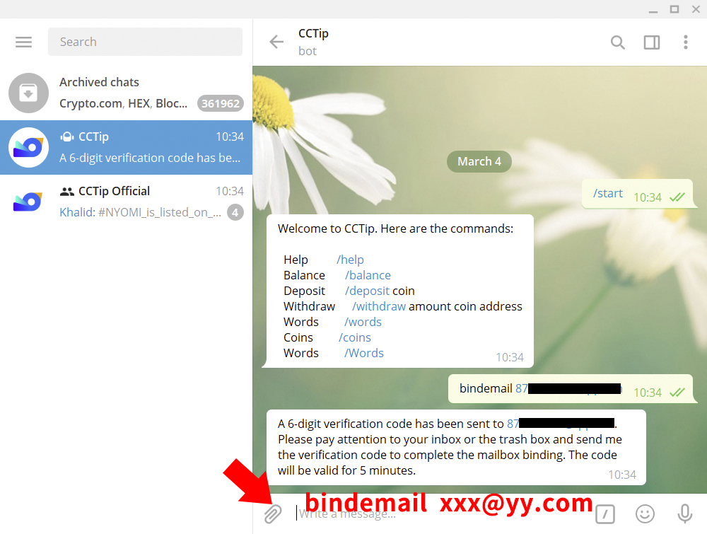
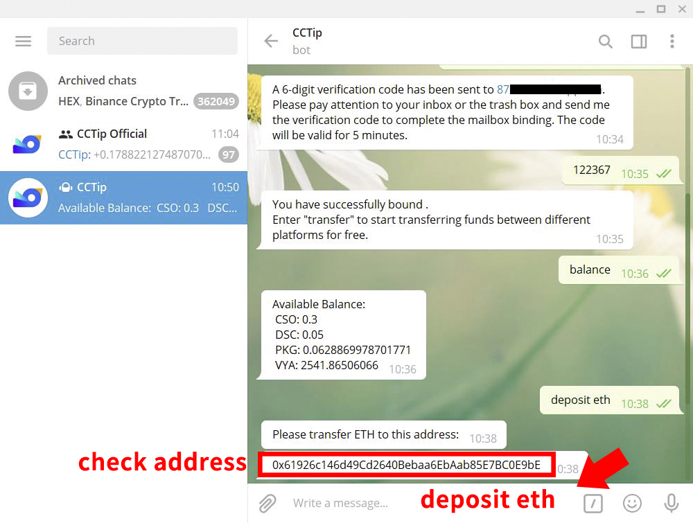
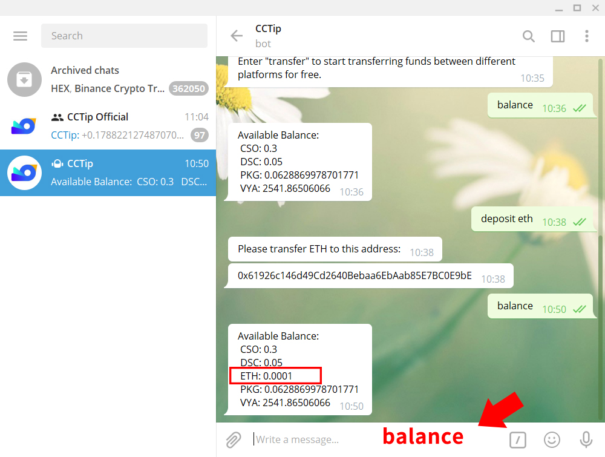

# CCTip Guide

## Overview

Welcome to CCTip! CCTip is a crypto currency tip tool. CCTip currently support 5 platforms including Twitter, Telegram, Reddit and Discord, and will support more platforms in the future.

**Click to view the user’s guide of the corresponding platform:**











## CCTip Swap

CCTip Swap supports fast, automated swap of tokens/coins, and is consistent with the automated market-making model XY=Z, making the whole process easier and saving the high gas fee on the chain. Meanwhile, 83% of each transaction fee will be added to the liquidity pool as incentives for liquidity providers when they remove liquidity.

### Swap coins/tokens in Page

#### How to swap tokens/coins?

Choose the pair you want to swap, enter the amount, click "**Swap**", and confirm the information.

Take "**ETH/USDT**" as an example.

1. Select "**ETH**" and "**USDT**", enter the amount you want to swap, and click "**Swap**" . 

2. After confirming the information, click "**Confirm**" to swap tokens.

#### How to add liquidity?

**83%** of each transaction fee will be added to the liquidity pool as incentives for liquidity providers when they remove liquidity.

**Currently we only support token pairs with USDT/ETH/DOGE/TRX.**

Take "ETH/USDT" as an example. Click "**Pool**", select "**ETH**" and "**USDT**" for tokens, enter the amount you want to add, and click "**Supply**". After confirming the information, click "**Confirm**".

#### How can I adjust an abnormal price of trading pairs? 

If you find the price abnormal, you can adjust it by swapping some tokens before adding liquidity. The steps are as follows: 

On the Add Liquidity page, select the corresponding trading pair, click "Unhappy with the price? Click here to adjust it", enter a desired price, and click "Next". After the swap, the price will be adjusted successfully. 

_Note: The adjusted price cannot be too close to the current price; otherwise the adjustment will fail._

#### How to remove liquidity?

After adding liquidity, you can remove some or all of the liquidity at any time.

Take the removal of "**ETH/USDT**" liquidity as an example.

1. Click "**Pool**", and click the added "**ETH/USDT**" liquidity to view the details.

2. Click "**Remove**".

3. After selecting the percentage of liquidity to be removed, click "**Remove Liquidity**". 

#### How to view transactions?

Click "**Record**" in the upper right corner to view your swap record and liquidity record.

### Swap coins/tokens with commands on Telegram

If you want to swap your coins/tokens for other coins/tokens, you can enter a command to swap.

#### **1. PM cctip\_bot to swap**

Take "**swap 1 DOGE for ETH**" as an example. PM cctip\_bot with **swap 1 DOGE ETH"**, and CCTip will tell you the optimal conversion rate. Click "**Confirm**" after confirming the information.

#### **2. Swap coins/tokens in the group**

Take "**swap 1 DOGE for ETH**" as an example.You only need to send "**cc swap 1 DOGE ETH**" in the group, CCTip will tell you the optimal conversion rate. Then click "**PM CCTip to swap**". PM CCTip and click "**start**". Click "**Confirm**" after confirming the information at last.

## CCTip·Convert

With CCTip, you can convert your favorite coins/tokens and post ads to set whatever conversion rate you want, and wait for others to convert coins/tokens with you.

### Convert coins/tokens via My CCTip

#### **How to start?**

In [My CCTip](https://my.cctip.io/), there are two entrances.

Entrance 1: Navigation bar on My CCTip "Exchange" - "Convert". [**Convert now**](https://my.cctip.io/token/exchange)

Entrance 2: Log in to [my.cctip.io,](https://my.cctip.io/twitter/dashboard) and click "**Convert**" in "**Action**" of the coin/token

\*\*\*\*

#### How to convert coins/tokens?

If you want to convert your coins/tokens to other coins/tokens, you can go to "[**Market**](https://my.cctip.io/token/exchange)", find the ad you want, and convert coins/tokens. If you don’t find the ad you like, you can also post an ad and set preferred conversion rate, and wait for others to convert coins/tokens with you.

Take "Convert ETH to DOGE" as an example. Complete the conversion in the following 3 steps:

1. Click "[**Market**](https://my.cctip.io/token/exchange)", select "**ETH**" and "**DOGE**"

2. Find an ad and click "**Convert**" 

3. After entering the amount, click "**Confirm**" to complete the conversion

_Note:_

_Free for posting ads. 1% for each transaction._

\_\_

#### How to post an ad and set the conversion rate?

If you don’t find the ad you like, you can also post an ad and set preferred conversion rate, and wait for others to convert coins/tokens with you.

Take "**Post an ad: Convert 0.000004 ETH to DOGE**" as an example. Complete the conversion in the following 4 steps:

1. Click **"Post an ad"** on "**My Ad**"

2. Select "**ETH"** and "**DOGE"**

3. Enter the amount and set the conversion rate

4. After confirming the information, click **"Confirm"**

After posting an ad, you can wait for others to convert coins/tokens with you. You can view your ad information in **"My ads"** and transaction record in **"Record"**. Every transaction will be in the Record.

_Notes:  
1. Free for posting ads, 1% for each transaction.  
2. The ad is valid for 7 days after it is posted, and will automatically expire if it is not completed within 7 days;  
3. During the ad validity, you can enter_  **"My ads"** _to manually remove the valid ad._

\_\_

### Convert coins/tokens with commands on Telegram

#### How to convert coins/tokens?

If you want to convert your coins/tokens to other coins/tokens, you can go to the "[**Market**](https://my.cctip.io/token/exchange)", find the ad you want, and convert coins/tokens. If you don’t find the ad you like, you can also post an ad and set preferred conversion rate, and wait for others to convert coins/tokens with you.

**1. PM cctip\_bot to convert**

Take "**Convert DOGE to ETH**" as an example. PM cctip\_bot with "**convert DOGE to ETH**‘', and CCTip will tell you the optimal conversion rate. Click "**Convert DOGE to ETH**". Follow the instructions and reply with the amount you want to pay or the amount you want to convert. If you want to convert to 0.0004 ETH, you should reply with "**0.0004 ETH**", and click "**Confirm**" after confirming the information.

Command format:

> convert token1 to token2

**2. Convert coins/tokens in the group**

Take "**Convert DOGE to ETH**" as an example. You only need to send "**cc convert DOGE to ETH**" in the group, CCTip will tell you the optimal conversion rate. If you are satisfied, you can click "**PM CCTip to convert DOGE to ETH**". PM CCTip and click "**start**". Reply with the amount you want to pay or the amount you want to convert. If you want to convert to 0.0004 ETH, you should reply with "**0.0004 ETH**", and click "**Confirm**" after confirming the information.

Command format:

> cc convert token1 to token2

#### 

#### How to post an ad and set the conversion rate?

If you don’t find the ad you like, you can also post an ad and set preferred conversion rate, and wait for others to convert coins/tokens with you.

#### 1. PM cctip\_bot to post an ad

Take "**Post an ad: Convert 1 ETH to 100,000 DOGE**" as an example. PM cctip\_bot with "**post 100000 DOGE for 1 ETH**". After the ad is posted, it will be valid for 7 days. You can share the ad to the group to make it known by more, and wait for others to convert coins/tokens with you.

Command format:

> post  amount1  token1  for  amount2  token2

#### 2. Post an ad in the group

If you post an ad in a group, the group members can directly see it and may convert coins/tokens with you. You can share the ad to the group to make it known by more, and wait for others to convert coins/tokens with you.

Take "**Post an ad: Convert 1 ETH to 100,000 DOGE**" as an example. You should send "**cc post 100000 DOGE for 1 ETH**" in the group. After the ad is posted, it will be valid for 7 days. You can share the ad to the group to make it known by more, and wait for others to convert coins/tokens with you.

Command format:

> cc  post  amount1  token1  for  amount2  token2

## Fund Transfer

### What is fund transfer?

CCTip currently supports free and fast transfer of funds between Twitter, Telegram, Reddit and Discord. You only need to bind the same email address to supported platforms, and PM CCTip with transfer commands.

### What are the benefits of fund transfer?

With funds transfer, you can:

Deposit coins on one platform and transfer them to other platforms for airdrops. For example, you can deposit 1 BTC in WeChat, transfer 0.3 BTC to your Telegram account, and airdrop it in the Telegram group.

Pay the transaction fee only once for withdrawal after transferring funds to the same platform. For example, you have 0.3 ETH in Telegram, 0.7 ETH in Twitter, and 1 ETH in Discord. You can transfer 0.3 ETH in Telegram and 0.7 ETH in Twitter to Discord's account and then transfer all the 2 ETH in Discord 2 to your wallet. In this case, you need to pay the transaction fee for the withdrawal only.

### How to transfer funds?

#### 1. Before transfer, you need to bind the same email address to each platform. PM CCTip on each platform and send the command to bind email. The commands for binding the email address are as follows:   

> bindemail xxx@yy.com

Note: After binding an email address, you can’t unbind it but can bind a new one. How to bind a new email address: PM CCTip for the command of binding email address on each platform, and then enter the new email address.

#### 2. After binding, transfer funds with the transfer command. The commands are as follows:   

> transfer TokenAmount TokenSymbol Twitter/Telegram/Reddit/Discord/...

E.g. PM @cctip\_io on Twitter with command "transfer 0.1 BTC Telegram".

### For example, to transfer 0.0001 ETH from Twitter to Telegram, follow the steps below:

#### 1.Bind the same email address to Twitter and Telegram

**\(1\) Bind Twitter account email address**

In Twitter, PM @cctip\_io \([https://twitter.com/cctip\_io](https://twitter.com/cctip_io)\) with the command "**bindemail xxx@yy.com**", check the verification code in your inbox, and reply to @cctip\_io with the code within 5 minutes to complete the binding.

**\(2\) Bind Telegram account email address**  
In Telegram, PM @cctip\_bot with the command "**bindemail xxx@yy.com**", check the verification code in your inbox, and reply to @cctip\_bot with the code within 5 minutes to complete the binding.

#### 2.Initiate a transfer

**\(1\) Initiate a transfer command in Twitter**  
PM @cctip\_io with the command "**transfer 0.0001 eth telegram**", and @cctip\_io will confirm the address of the payment platform with you.

**\(2\) Confirm the deposit address in Telegram**  
In Telegram, PM @cctip\_bot with the command "**deposit eth**", and check if the payment address is correct.

**\(3\) Confirm the transfer in Twitter**  
After confirming the payment address, reply "**confirm xxxxxxxxx**" as instructed by @cctip\_io to complete the transfer.

#### 3. Go to Telegram to check the balance change

PM @cctip\_bot with the command "**balance**" to check the balance.

