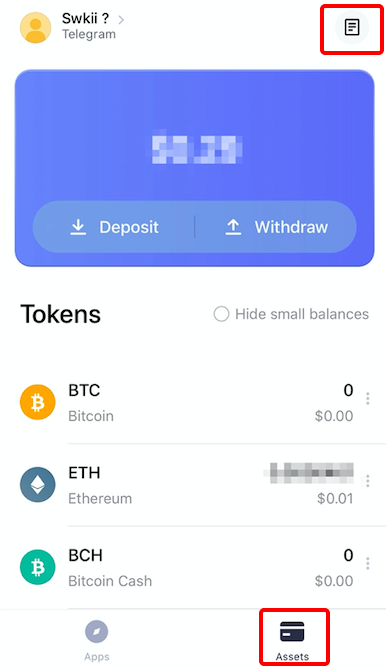

# CCTip Box Guide

## How to make the best of the Apps in CCTip Box

### Log in to the App with your CCTip account

When you open the App, you will log in with the currently logged-in CCTip account by default.

Take "Crash" as an example. Now I have logged in to my Telegram account in the App. When I enter the App "Crash", I will log in and pay with my Telegram account by default.

If you need to switch accounts, please[ switch](https://doc.cctip.io/cctipbox-guide#how-to-switch-the-account) in the App account.

### How to pay with CCTip in the App?

It only takes 2 steps to pay in the App. Take "Crash" as an example:

1. Find "Deposit" in "Crash", enter the deposit amount, and click "Next";
2. Enter the payment password to deposit coins/tokens.

### How to withdraw the assets in the App to CCTip?

It only takes 2 steps to withdraw assets to CCTip in the App. Take "Crash" as an example:

1. Find "Withdraw" in "Crash";
2. Select the coin/token to be withdrawn, enter the amount, and click "Confirm";

## CCTip Asset Management

### How to deposit coins/tokens?

There are two ways to deposit coins/tokens to CCTip.

**Method 1: Deposit assets directly in "Assets"**

1. Click "Deposit" in the "Assets";
2. Select the coin/token;
3. Deposit the corresponding coin/token to your exclusive deposit address.

#### Method 2: Deposit assets in the page of the specific coin/token

1. Find the coin/token to be deposited in the "Assets", and click "Deposit";
2. Deposit the specific coin/token to your exclusive deposit address.

**Notes:  
1. Please do not deposit coins/tokens other than the specific one to the above address; otherwise the coins/tokens will be lost!  
2. Coins/Tokens deposited to the above address may not be credited to the account immediately. The time varies from 5 minutes to 60 minutes, depending on the network environment of the chain. Your patience would be appreciated.**

### **How to withdraw coins/tokens?**

There are two methods to withdraw assets in CCTip to other addresses.

#### Method 1: Withdraw coins/tokens in the "Assets"

1. Click "Withdraw" in the "Assets";
2. Select the coin/token, and enter the amount and address;
3. Enter the payment password, and wait for the confirmation of withdrawal.

#### Method 2: Withdraw coins/tokens in the page of the specific coin/token

1. Find the coin/token to be withdrawn in the "Assets" and click "Withdraw";
2. Enter the payment password, and wait for the confirmation of withdrawal.

### How to check transactions?

For the time being, only deposit and withdrawal of CCTip accounts and deposit to merchants/withdrawal from merchants to CCTip can be queried.

Click "**Transactions**" in the "**Assets**" to check relevant records. 

## Account Settings

### How to log in to/switch/log out of the account?

Before you enjoy Apps or check assets in the account, you need to log in to your CCTip account first.

### How to log in to the account?

Before you enjoy Apps or click the "**Assets**", log in with your account.

#### **How to log in with a Telegram account?** 

1. Select **Telegram** in CCTip Box, enter the phone number, and click "**Next**". 

2. Open the **Telegram App**, find the authorization dialog sent from **Telegram,** and click "**Confirm**". 

3. Return to **CCTip Box**, and you will automatically enter "Apps" page logged in.

#### How to log in with a Twitter account?

1. Select Twitter, enter the account and password, and click "**Authorize app**". 

After logging in, you will automatically enter “Apps“ page page.

### How to switch the account?

To switch the account, you can click the account in the upper left corner in the "**Assets**", and then click "Switch" in the "Account" to select another login account.

### How to log out of the account?

To switch the account, you can click the account in the upper left corner in the "**Assets**", and then click "Log Out" in the "Account". After you log out, you will go back to the App page automatically.

### How to set the payment password?

The payment password is required for all operations such as payment or withdrawal.

It only takes 2 steps to set the payment password.

1. Click the account in the upper left corner in the "**Assets**" to enter the "**Account**";
2. Click "Payment Password" to set one.

## Account Security

### How to set/change the payment password?

Please set a payment password for CCTip, which is required for operations such as withdrawal.

The steps are as follows:  
Set and change the password in "**Account Security**" - "**Payment Password**".

**Notes:  
After the payment password is changed, operations related to assets such as withdrawal, rewards, airdrops, conversion, and transfers are unavailable within 24 hours.**

### **What if I forget my password?**

If you forget your password, you can reset it through email verification. Before resetting your password, please bind an email.

The steps are as follows:  
****In "**Account Security**" - "**Payment Password**" click Forgot Password, enter a new password and email verification code.

**Notes:  
After the payment password is reset, operations related to assets such as withdrawal, rewards, airdrops, conversion, and transfers are unavailable within 24 hours.**

### How to bind/change the email?

For asset safety, please bind your email. In the double verification and other operation related to resetting the payment password, you need to enter the email verification code. To ensure asset security, the email can be changed in [my.cctip](https://my.cctip.io/) and [CCTip Box App](https://my.cctip.io/download) only.  
Bind or change the email in "**Account Security**" - "**Email**".

The steps are as follows:

_Notes:  
After the email is changed,   
1. the current email will be **unbound** with accounts on **CCTip all platforms**;   
2. **the double verification** of the unbound email account will **be turned off.**_

### How to turn on/off double verification?

To turn on double verification, you need to first set a payment password and bind an email. With this mode on, any operation related to assets requires the verification of the payment password and email verification code.

Turn on double verification:  
Before turning it on, please set the payment password and bind the email. When finished, click the button to turn it on.

Turn off double verification:  
Click the button to verify the payment password and email verification code.

### How to change the daily limit of CCTip Bot?

The daily limit of CCTip Bot is applicable to transfer \(except withdrawals\) channels that directly talk to CCTip Bot on platforms such as Twitter/Telegram/Discord/Reddit, and does not include the transfer amount in the CCTip Box. The default value is $1,000. For asset safety, the daily limit of CCTip Bot can only be changed in [my.cctip](https://my.cctip.io/) and [CCTip Box App](https://my.cctip.io/download) only.

All assets-related operations on Twitter/Telegram/Discord/Reddit, including withdrawal, airdrops, rewards, draws, rains, issuing newcomer rewards, advertising, and conversion. 

The steps are as follows:  
In "**Account Security**" - "**CCTip Bot Daily Limit**", click Change, enter the value, and verify the payment password.

### What does CCTip assets-related operations include?

#### 1. All assets-related operations in the app.

Including withdrawal, conversion, and deposit to third-party applications. 

#### 2. All assets-related operations on Twitter/Telegram/Discord/Reddit.

Including withdrawal, airdrops, rewards, draws, rains, issuing newcomer rewards, advertising, and conversion. 

#### 3. All assets-related operations on my.cctip.

Including withdrawal, conversion, and token listing.

## FAQ

### What is the reward pool?

To offer users more airdrop rewards, [CCTip Box](https://my.cctip.io/download?utm_source=mycctip&utm_medium=poolguide) has launched daily tokens, daily draw, and weekly draw. Users can receive daily airdrops for free in [CCTip Box](https://my.cctip.io/download?utm_source=mycctip&utm_medium=poolguide) and join the draw to win huge bonuses.

Source of rewards: Every time a user receives a CCTip airdrop for free, CCTip will allocate 8% of the airdrop to the pool. Users receive 1 free airdrop in [CCTip Box](https://my.cctip.io/download?utm_source=mycctip&utm_medium=poolguide) every day, and after participating in the daily and weekly draws, they will have the opportunity to share huge rewards.

Allocation of rewards: All the rewards in the pool will be allocated to daily tokens, daily draw, and weekly draw. \(CCTip will not draw any fees from the pool\)

**Rules of allocation:**

60% of the general reward pool on the day will be allocated to the pool for **Daily Tokens** __every day \(each user receives a random share of the reward pool for **Daily Tokens** of the day\)

20% of the general reward pool on the day will be allocated to the reward pool of the day for **Daily Draw** \(10 users are randomly drawn every day to equally share the reward pool of the day\) 

20% of the general reward pool of the day will be allocated, for 7 consecutive days in a week, to the reward pool for **Weekly Draw** \(10 users will be randomly drawn every week to equally share the reward pool of the week\)

### What if I forget the payment password?

If you have forgotten the payment password of CCTip Box, please first try the passwords that you might have set. If that does not work, please wait the update of the App. The app will support resetting payment password soon. We appreciate your patience and understanding in this matter. The next version will come as soon as possible.

### Why did I fail to authorize Telegram to log in to CCTip Box? 

Please check whether it is due to Telegram as instructed below:  
[Click here](https://telegram.org/js/telegram-widget.js) to open the link

If you can't open the link, that means **the third-party authorization via Telegram is not supported in your area, and we cannot solve such problems for you.**

If you can successfully open the link and see the following page, please [click here](https://cctip.io/index%20) and find the online customer service and reply the following information:   
1. Phone: iOS or Android?   
2. The country you're from?   
3. Via which platform to log in? Twitter or Telegram?  
4. Has the account been suspended?

## [Privacy Policy](https://doc.cctip.io/cctipbox-guide/privacy-policy)

## [User Agreement](https://doc.cctip.io/cctipbox-guide/service-terms-and-conditions-of-use) 

