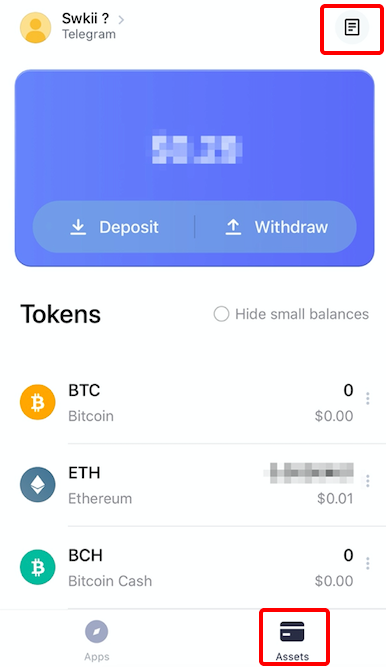

# How to check transactions?

For the time being, only deposit and withdrawal of CCTip accounts and deposit to merchants/withdrawal from merchants to CCTip can be queried.

Click "Transactions" in the "Assets" to check relevant records. 

## 

