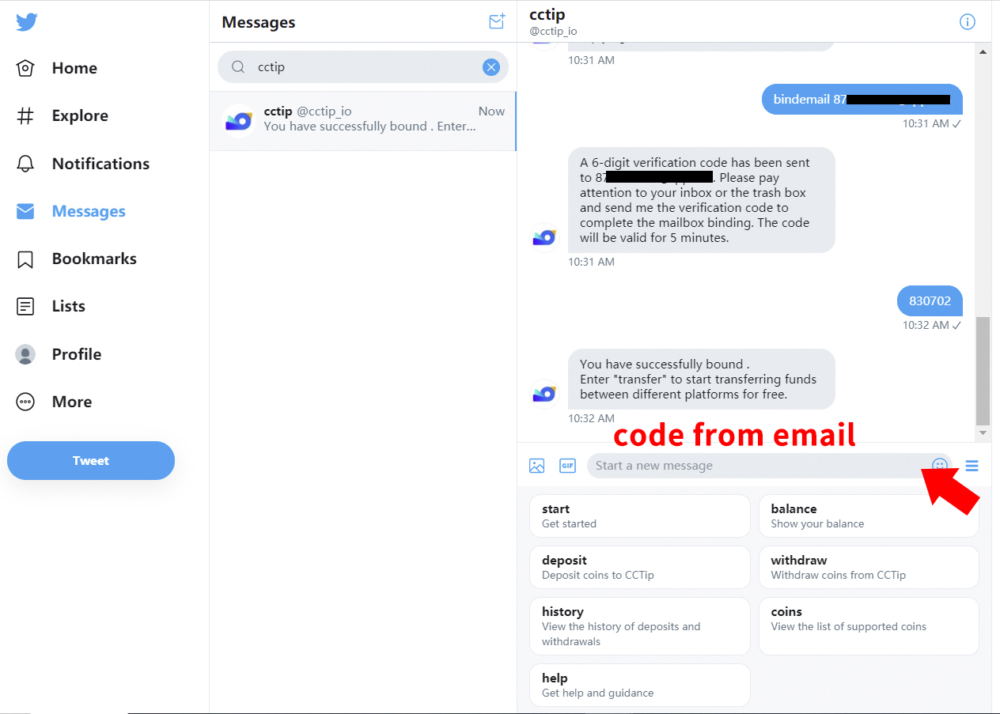
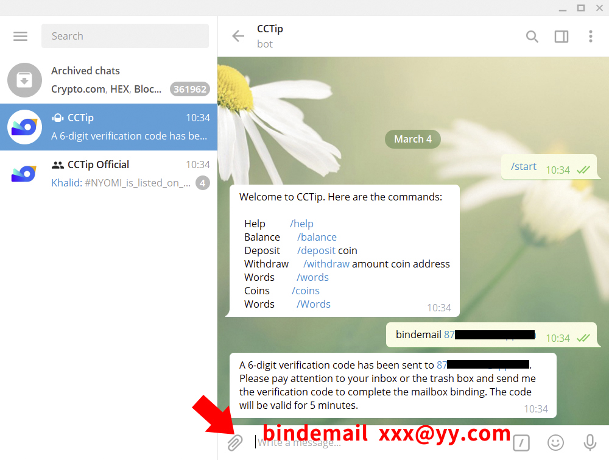
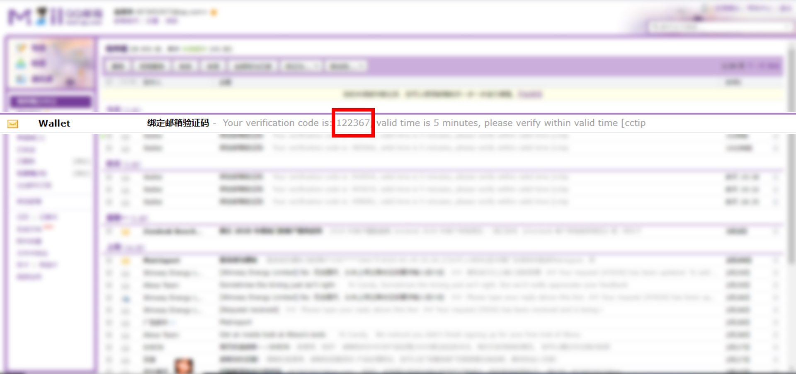
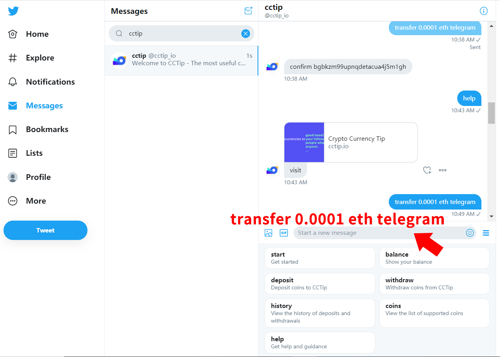
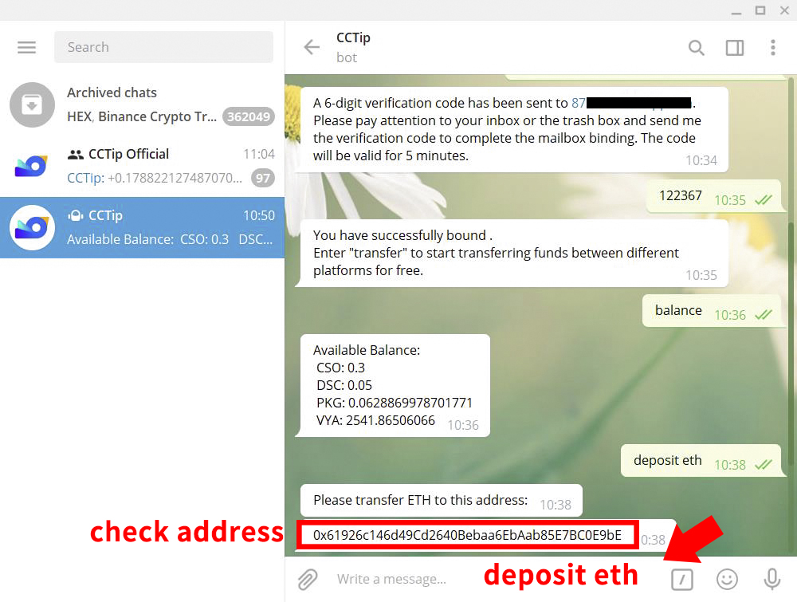
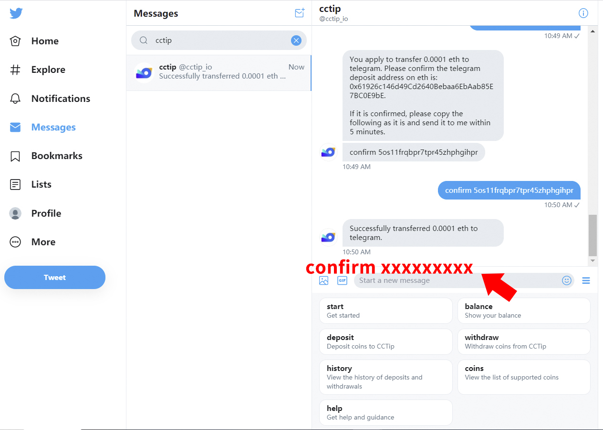

# Transfer through command

### What is fund transfer through command？

CCTip currently supports free and fast transfer of funds between Twitter, Telegram, Reddit, Discord. You only need to bind the same email address to supported platforms, and PM CCTip with transfer commands.

### What are the benefits of fund transfer?

With funds transfer, you can:

Deposit coins on one platform and transfer them to other platforms for airdrops. For example, you can deposit 1 BTC in Twitter, transfer 0.3 BTC to your Telegram account, and airdrop it in the Telegram group.

Pay the transaction fee only once for withdrawal after transferring funds to the same platform. For example, you have 0.3 ETH in Telegram, 0.7 ETH in Twitter, and 1 ETH in Discord. You can transfer 0.3 ETH in Telegram and 0.7 ETH in Twitter to Discord's account and then transfer all the 2 ETH in Discord 2 to your wallet. In this case, you need to pay the transaction fee for the withdrawal only.

### How to transfer funds?

#### 1. Before transfer, you need to bind the same email address to each platform. PM CCip on each platform and send the command to bind email. The commands for binding the email address are as follows:   

> bindemail xxx@yy.com

Note: After binding an email address, you can’t unbind it but can bind a new one. How to bind a new email address: PM CCTip for the command of binding email address on each platform, and then enter the new email address.

#### 2. After binding, transfer funds with the transfer command. The commands are as follows:   

> transfer TokenAmount TokenSymbol Twitter/Telegram/Reddit/Discord/...

E.g. PM @cctip\_io on Twitter with command "transfer 0.1 BTC Telegram".

### For example, to transfer 0.0001 ETH from Twitter to Telegram, follow the steps below:

#### 1.Bind the same email address to Twitter and Telegram

**\(1\) Bind Twitter account email address**

In Twitter, PM @cctip\_io \([https://twitter.com/cctip\_io](https://twitter.com/cctip_io)\) with the command "**bindemail xxx@yy.com**", check the verification code in your inbox, and reply to @cctip\_io with the code within 5 minutes to complete the binding.

**\(2\) Bind Telegram account email address**  
In Telegram, PM @cctip\_bot with the command "**bindemail xxx@yy.com**", check the verification code in your inbox, and reply to @cctip\_bot with the code within 5 minutes to complete the binding.

#### 2.Initiate a transfer

**\(1\) Initiate a transfer command in Twitter**  
PM @cctip\_io with the command "**transfer 0.0001 eth telegram**", and @cctip\_io will confirm the address of the payment platform with you.

**\(2\) Confirm the deposit address in Telegram**  
In Telegram, PM @cctip\_bot with the command "**deposit eth**", and check if the payment address is correct.

**\(3\) Confirm the transfer in Twitter**  
After confirming the payment address, reply "**confirm xxxxxxxxx**" as instructed by @cctip\_io to complete the transfer.

#### 3. Go to Telegram to check the balance change

PM @cctip\_bot with the command "**balance**" to check the balance.

