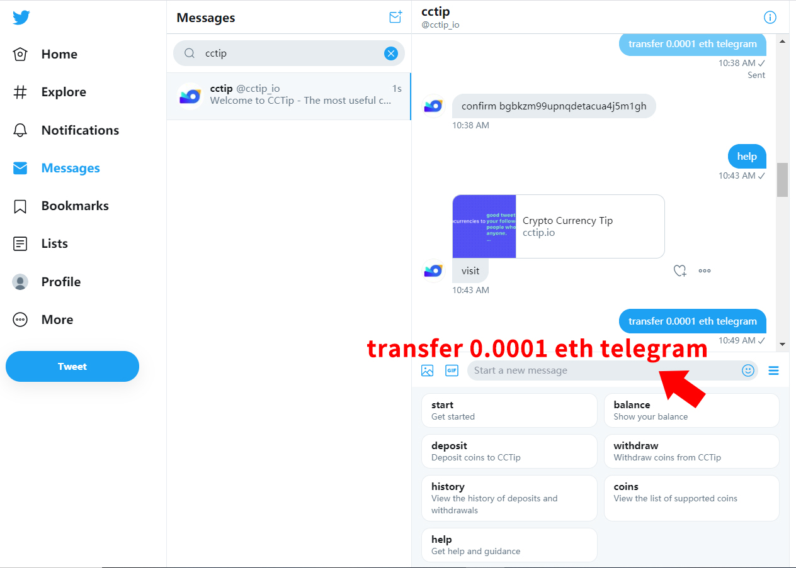

# CCTip 使用指引

## 总览

欢迎使用 CCTip，CCTip 是一个数字货币打赏工具，目前支持 Twitter 、Telegram、Reddit 和 Discord，后续将支持更多平台。使用 CCTip 非常简单，无需下载安装 App，在 各大平台上输入特定指令就能发送加密货币。

**点击查看对应平台的使用指引：**













## **CCTip Swap**

CCSwap 支持快速自动化兑换代币，满足 XY=Z 自动化做市模式，让币币兑换变得简单、快速 ，再也不需要支付链上高额的 gas fee。同时，为了激励流动性提供者，CCSwap 每笔交易手续费的 83% 会被添加到流动性池中。流动性提供者可以在移除流动性时获得这份奖励。

### 在 CCTip Swap 页面中进行兑换

#### 如何兑换？

选择你要兑换的交易对，输入你要兑换的金额，点击兑换，确认信息后即可。

以 “**ETH/USDT**” 为例。

1. 代币选择 “**ETH**”、“**USDT**”，输入你要兑换的金额，点击 “**Swap**” 。

2. 确认信息后，点击 “**Confirm**”，即可兑换成功。

\*如果没有找到你希望兑换的交易对，请在 Telegram 上联系 [@](https://t.me/LiserLee)[SeaBubble](https://t.me/SeaBubble) 添加一个新的交易池子，并注入流动性。

#### 如何添加流动性并赚取手续费？

为了激励流动性提供者，CCSwap 每笔交易手续费的 83% 会被添加到流动性池中。流动性提供者可以在移除流动性时获得这份奖励。

目前仅支持包含 USDT/ETH/DOGE/TRX 的交易对。

以 “**ETH/USDT**” 为例。点击 “**Pool**”，代币选择 “**ETH**”、“**USDT**”，输入你要注入的金额，点击 “**Supply**”。确认信息后，点击 “**Confirm”**，即可添加成功。

#### 交易对价格太反常了，我如何调整价格？

当价格不符合常理时，你可以在添加流动性前，先用一部分代币进行兑换来调整价格。操作步骤如下：

在添加流动性页面，选择对应的交易对，点击 “不满意价格？点击这里调整“，输入想要调整的价格后，点击 “下一步“，兑换成功后，价格将会调整成功。

注意：调整的价格不得与当前价格过于接近，否则将无法进行调整。

#### 如何移除流动性？

在添加流动性后，你可以随时移除部分或全部流动性。

以 移除 “**ETH/USDT**” 流动性为例。

1. 点击 **“Pool**”，找到添加过的 “**ETH/USDT**” 流动性，点击查看流动性详情。

2. 点击 “**Remove**”。

3. 选择移除流动性的百分比后，点击 “**Remove Liquidity**”。移除完成。

#### 如何查看交易？

点击右上角的 “**记录**”，即可查看你的兑换记录与添加/移除流动性记录。

### 通过指令在 Telegram 兑换

#### 如何兑换代币？

如果你想将自己的代币兑换成其他的代币，你可以直接在群内或私聊通过指令进行兑换。

#### 1. 私聊进行兑换

以 “将 **1 DOGE 兑换成 ETH**” 为例，只需要私聊 cctip\_bot 发送指令 “**swap 1 DOGE ETH**”，CCTip 将会回复你当前的汇率与，确认兑换信息后，点击确认即可。

#### 2. 群聊进行兑换

以 “将 **1 DOGE 兑换成 ETH**” 为例，只需要在群内发送指令 “**cc swap 1 DOGE ETH**”，CCTip 将会回复你当前的汇率。点击 “PM CCTip to swap”，并按照机器人的指令进入机器人的私聊窗口，点击 “**start**”。确认兑换信息后，点击确认即可。

## CCTip Convert

在 CCTip 中，你可以兑换你喜欢的代币，还可以发布广告设置心仪的汇率，等待别人与你兑换。

### 通过 My CCTip 网页进行兑换

#### **如何进入兑换页面？**‌

在 [My CCTip](https://my.cctip.io/) 中，你可以通过以下两个入口进入[兑换页面](https://my.cctip.io/token/exchange)，开始兑换。

**入口一：My CCTip 官网导航栏 “必用工具**” **- “**[**兑换代币**](https://my.cctip.io/token/exchange)”

**入口二：登录 My CCTip，在对应代币的操作栏中点击 “兑换**”

\*\*\*\*

#### **如何兑换代币？**

如果你想将自己的代币兑换成其他的代币，你可以前往[代币市场](https://my.cctip.io/token/exchange)，查看不同的广告，找到最优的广告，进行兑换。如果没有找到合适的广告，也可以自己发布一条广告，设置你满意的汇率，等待他人与你兑换。

以 “将 1 ETH 兑换成 DOGE” 为例，通过以下 3 个步骤完成兑换：

1. 在[市场](https://my.cctip.io/token/exchange)页选择你想用 ETH 兑换成 DOGE

2. 找到最优的广告，点击 “**兑换**” 按钮

3. 输入支付数量或兑换数量后，点击 “**确认**” 完成兑换

_说明：_  
****_发布广告不收取手续费，成交时收取 1%_

\_\_

#### **如何发布广告设置心仪的汇率，等待他人与你兑换？**

如果你在广告市场没有找到合适的广告进行兑换，你可以自行发布一条广告，设置你满意的汇率，等待他人与你兑换。

**以 “发布一则广告： 1 ETH 兑换成 10000 DOGE**” **为例，通过以下 3 个步骤完成兑换：**

1. 在我的广告中点击 ****“**发布广告**”，进入发布广告页面

2. 代币选择 ETH 兑换成 DOGE

3. 汇率设置为 1 ETH = 10000 DOGE

4. 确认信息后，点击 **“发布**”，即可完成发布

发布成功后，就可以等待他人与你兑换了，你可以随时在 “**我的广告**” 查看你的广告信息和 “**成交记录**” 中查看成交记录。每有一笔成交，都会在成交记录中出现。

_说明**：**  
1. 发布广告不收取手续费，成交时收取 1%；  
****2. 发布后广告有效期为 7 天，7 天未完成将自动下架；  
3. 在广告发布期间，可进入“我的广告“中，手动下架有效的广告。_

\_\_

### 通过指令在 Telegram/Discord 兑换

#### 如何兑换代币？

如果你想将自己的代币兑换成其他的代币，你可以前往代币市场，查看不同的广告，找到自己心仪的汇率，进行兑换。如果没有找到合适的广告，也可以自己发布一条广告，设置心仪的汇率，等待他人与你兑换。

#### 1. 私聊进行兑换

以 “将 DOGE 兑换成 ETH” 为例，只需要私聊 cctip\_bot 发送指令 “**convert DOGE to ETH**”，CCTip 将会回复你当前市场的最优汇率与可兑换数量，按照机器人的指令回复你想支付的数量或你想兑换的数量。如果你想支付 **0.0004** ETH 兑换成 DOGE，你只需要回复 “**0.0004 ETH**” ，确认兑换信息后，点击确认即可。

#### 2. 群中进行兑换

以 “将 DOGE 兑换成 ETH” 为例，只需要在群内发送指令 “**cc convert DOGE to ETH**”，CCTip 将会回复你当前市场的最优汇率与可兑换数量。如果对汇率还满意的话，可以点击“**convert**”，并按照机器人的指令进入机器人的私聊窗口，点击 “**start**”，你只需要回复 “**0.0004** **ETH**”，确认兑换信息后，点击确认即可。

指令格式：

> cc convert token1 to token2

#### 

#### 如何发布广告设置心仪的汇率，等待他人与你兑换？

如果你在广告市场没有找到合适的广告进行兑换，你可以自行发布一条广告，设置心仪的汇率，等待他人与你兑换。

#### 1. 私聊发布广告

以 “我想发布一则广告，用 10000 DOGE 兑换 1 ETH” 为例，只需要私聊 cctip\_bot 发送指令 “**post 10000 DOGE for 1 ETH**”，广告将立即发布成功，有效期为 7 天。你可以将广告分享至群内，让更多的人看到你的广告，接下来就等待他人过来与你兑换吧。

指令格式：

> post amount1 token1 for amount2 token2

#### 2. 群内发布广告‌

在群内发布广告，群成员可直接在群内看到你发布的广告，并与你进行兑换。同时你也可以将广告分享至更多的群，让更多的人看到你的广告。接下来就等待他人过来与你兑换吧。

**以 “发布一则广告： 1 ETH 兑换成 10000 DOGE**” **为例**，只需要在群内发送指令 “**cc post 10000 DOGE for 1 ETH**”，广告将立即发布成功，有效期为 7 天，接下来就等待他人过来与你兑换吧。

指令格式：

> cc post amount1 token1 for amount2 token2

## 资金划转

### 什么是资金划转？

CCTip 目前已支持在 Twitter，Telegram，Reddit 和 Discord 之间免费快速划转资金，你只需要在各个平台中绑定相同邮箱，在各个平台私信 CCTip 发送划转指令即可。

### 资金划转有什么好处？

通过资金划转，你可以：

在一个平台充值，划转至其他平台进行空投。例如，你可以在 Discord 中充值 1 BTC，划转 0.3 BTC 至 Telegram 账户，在 Telegram 群进行空投。

将资金划转至同一平台后提现，仅支付一次手续费。例如，你在 Telegram、Twitter 和 Discord 中的资金分别为 0.3 ETH、0.7 ETH 和1 ETH，你可以将 Telegram 中的 0.3 ETH 和 Twitter 中的 0.7 ETH 统一划转至 Discord 的账户中，将 Discord 中 2 ETH 一起提现至你的钱包，仅需支付该笔提现交易的手续费。

### 如何划转？

#### 1. 在划转前，你需要在各个平台绑定同一邮箱，绑定邮箱指令如下：   

> Twitter/Telegram/Reddit/Discord... ：bindemail xxx@yy.com

注意：绑定邮箱后不支持解绑邮箱，但支持重新绑定。重新绑定方法：在各平台私信机器人绑定邮箱的指令，输入新的邮箱地址即可。

#### 2. 绑定后，通过划转资金指令完成划转。划转资金指令如下：   

> Twitter/Telegram/Reddit/Discord...：  
> transfer 代币数量 代币符号 Twitter/Telegram/Reddit/Discord/Wechat...

例如：在 Twitter 中私聊 @cctip\_io 回复指令 “**transfer 0.1 BTC Telegram**”。

### 以将 Twitter 中的 0.0001 eth 划转至 Telegram 为例，划转步骤如下：

#### 1.在 Twitter、Telegram 绑定同一邮箱

**（1）绑定 Twitter 账户邮箱**  
在 Twitter 中，私聊 @cctip\_io 发送指令 “**bindemail xxx@yy.com**”，前往邮箱查看验证码，并在 5 分钟内回复 @cctip\_io，完成绑定。

**（2）绑定 Telegram 账户邮箱**  
在 Telegram 中，私聊 @cctip\_bot 发送指令 “**bindemail xxx@yy.com**”，前往邮箱查看验证码，并在 5 分钟内回复 @cctip\_bot，完成绑定。

#### 2. 发起划转

**（1）在 Twitter 中发起划转指令**  
私聊 @cctip\_io 发送指令 “**transfer 0.0001 eth telegram**”，@cctip\_io 将向你确认收款平台地址。

**（2）在 Telegram 中确认充值地址**  
在 Telegram 中，私聊 @cctip\_bot 发送指令 “**deposit eth**”，核对收款地址是否正确。

**（3）在 Twitter 中确认划转**  
核对收款地址无误后，按照 @cctip\_io 的指示回复 “**confirm xxxxxxxxx**”，划转成功。

#### 3.前往 Telegram 查看余额变动情况

私聊 @cctip\_bot 发送指令 “**balance**”，查看余额。

