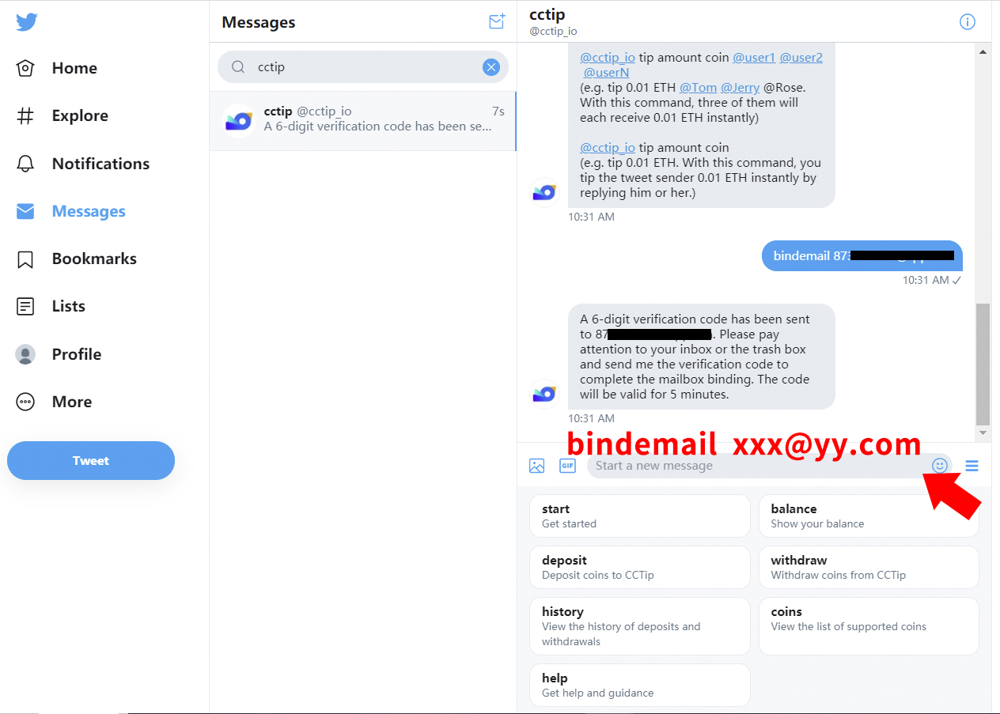
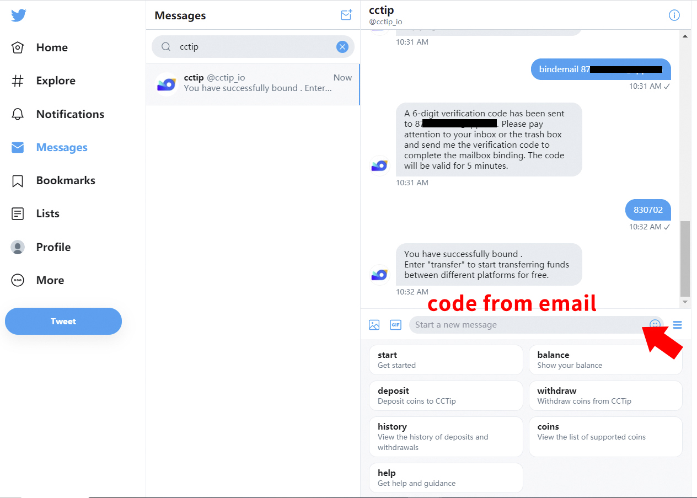
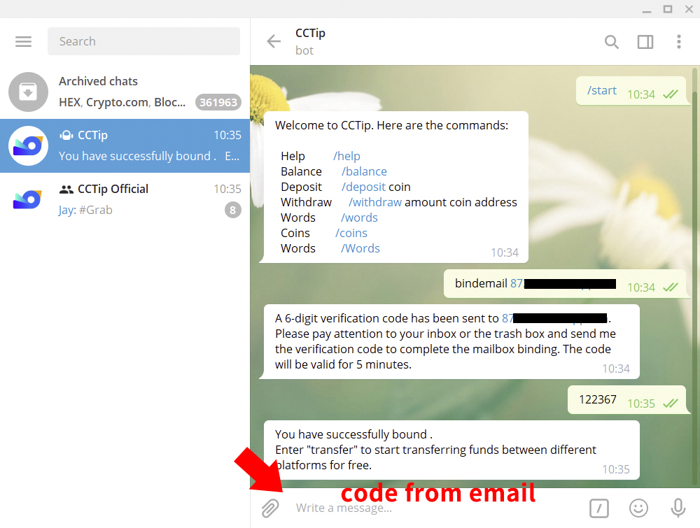
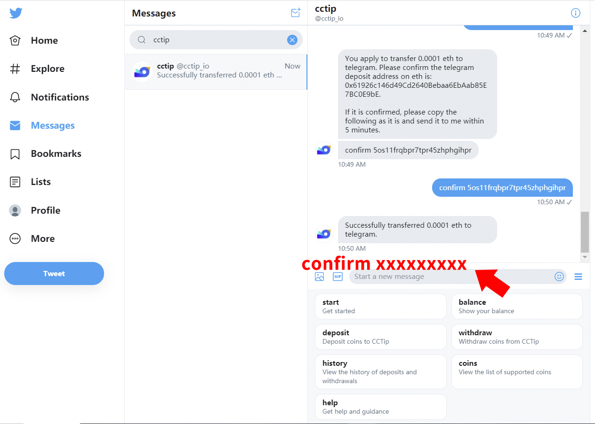

# 通过指令划转

**\*指令划转仅支持在不同平台绑定了相同邮箱的账号间划转。**

### 什么是资金划转？

CCTip 目前已支持在 Twitter，Telegram，Reddit 和 Discord 之间免费快速划转资金，你只需要在各个平台中绑定相同邮箱，在各个平台私信 CCTip 发送划转指令即可。

### 资金划转有什么好处？

通过资金划转，你可以：

在一个平台充值，划转至其他平台进行空投。例如，你可以在 Discord 中充值 1 BTC，划转 0.3 BTC 至 Telegram 账户，在 Telegram 群进行空投。

将资金划转至同一平台后提现，仅支付一次手续费。例如，你在 Telegram、Twitter 和 Discord 中的资金分别为 0.3 ETH、0.7 ETH 和1 ETH，你可以将 Telegram 中的 0.3 ETH 和 Twitter 中的 0.7 ETH 统一划转至 Discord 的账户中，将 Discord 中 2 ETH 一起提现至你的钱包，仅需支付该笔提现交易的手续费。

### 如何划转？

#### 1. 在划转前，你需要在各个平台绑定同一邮箱，绑定邮箱指令如下：   

> Twitter/Telegram/Reddit/Discord... ：bindemail xxx@yy.com

注意：绑定邮箱后不支持解绑邮箱，但支持重新绑定。重新绑定方法：在各平台私信机器人绑定邮箱的指令，输入新的邮箱地址即可。

#### 2. 绑定后，通过划转资金指令完成划转。划转资金指令如下：   

> Twitter/Telegram/Reddit/Discord...：  
> transfer 代币数量 代币符号 Twitter/Telegram/Reddit/Discord/...

例如：在 Twitter 中私聊 @cctip\_io 回复指令 “**transfer 0.1 BTC Telegram**”。

### 以将 Twitter 中的 0.0001 eth 划转至 Telegram 为例，划转步骤如下：

#### 1.在 Twitter、Telegram 绑定同一邮箱

**（1）绑定 Twitter 账户邮箱**  
在 Twitter 中，私聊 @cctip\_io 发送指令 “**bindemail xxx@yy.com**”，前往邮箱查看验证码，并在 5 分钟内回复 @cctip\_io，完成绑定。

**（2）绑定 Telegram 账户邮箱**  
在 Telegram 中，私聊 @cctip\_bot 发送指令 “**bindemail xxx@yy.com**”，前往邮箱查看验证码，并在 5 分钟内回复 @cctip\_bot，完成绑定。

#### 2. 发起划转

**（1）在 Twitter 中发起划转指令**  
私聊 @cctip\_io 发送指令 “**transfer 0.0001 eth telegram**”，@cctip\_io 将向你确认收款平台地址。

**（2）在 Telegram 中确认充值地址**  
在 Telegram 中，私聊 @cctip\_bot 发送指令 “**deposit eth**”，核对收款地址是否正确。

**（3）在 Twitter 中确认划转**  
核对收款地址无误后，按照 @cctip\_io 的指示回复 “**confirm xxxxxxxxx**”，划转成功。

#### 3.前往 Telegram 查看余额变动情况

私聊 @cctip\_bot 发送指令 “**balance**”，查看余额。

